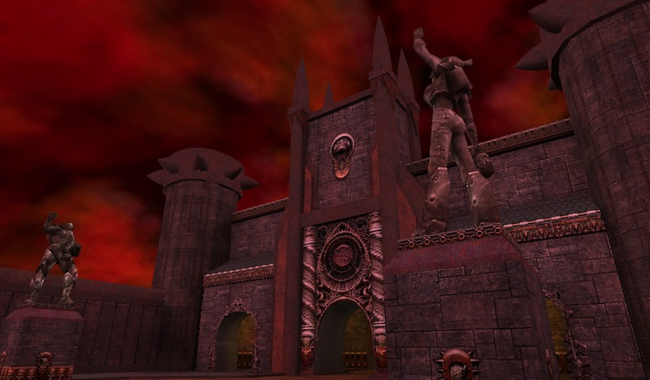
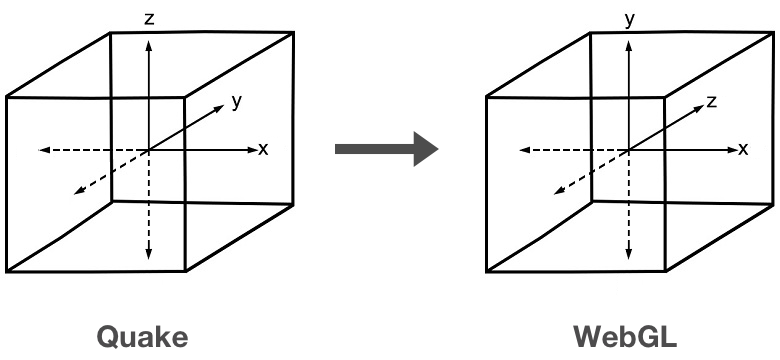

# Quake 3 Arena renderer

This project aims to render Quake 3 Arena maps in the browser with the [Elm programming language][5] and the WebGL API.

[Try the demo][demo]



**Note**: the demo is not likely to work on outdated handheld devices. Moreover, navigation in the maps is only possible with keyboard for now.

## Build locally 

You will need the original Quake 3 Arena game assets to get the demo running on your machine. Please see `baseq3/README.md` for more details. 

You can compile the demo like any other Elm app by running the following `elm make` command:

```
elm make src/Main.elm --output=static/app.js
```

## Related work

The idea was prompted by [Brandon Jones' JavaScript version][2]. Brandon has written a couple of informative blog posts ([here][3] and [here][4]) about his project that shaped my work too. 

Being Elm a pure functional programming language means that a direct port of the JavaScript code was not possible. Most of the work done was to rethink the whole approach, starting from BSP file parsing and ending with pre-baking the GLSL shaders into the Elm code. 

## Technical overview

### Coordinate system



The renderer follows the Quake coordinate system so Z>0 pointing up, X>0 axis extends to the right and Y>0 estends forward the viewer. In other words:

> This means, take your left hand and point your arm forwards. Point your thumb upwards, your index finger forwards and your middle finger directly to the right. Let's assume that we are standing at the origin in our (...) map, facing northwards. Now, your middle finger is pointing in the direction of positive X coordinates, your index finger is pointing to positive Y coordinates, and your thumb is pointing to positive Z coordinates. — [Source][1]

By using `Mat4.makeLookAt` function and specifing Z as the "up" axis the renderer translate the coordinates from the Quake system to the one used by WebGL (see module `Camera.elm`). 

### BSP file parsing 

A file with a `.bsp` extension contains arena information about geometry, lighting, shaders and game entities. All the parsing of the BSP file has been done using [`elm-byte-parser` package][7]. 

A BSP file starts a with a so-called "lump directory", followed by each lump which stores a specific kind of data (game entities, shaders, planes, and so on). Using lumps offset and length values found in the directory is then possible to read actual lump data via the [`Bytes.Parser.randomAccess` function][8].

### Faces and meshes creation 

Once the all the arena faces have been parsed they are grouped by shader and light map indices. This helps to speed up the rendering process since texture switching is minimized during the draw calls. Once these groups have been identified  a single triangle mesh for each group is created.

In a typical arena three kinds of geometry are present: polygonal faces; biquadratic Bezier surfaces; and triangle meshes, also called "models". Both polygonal faces and triangle meshes are created the same way using the [`indexedTriangles`][9] function. 

Bezier surfaces cannot be rendered directly by WebGL, hence first they have be converted into triangles using a process called "tessellation" (see module `Bezier.elm`). In a nutshell, the tessellation function evaluates multiple 3×3 points Bezier surfaces (appropriately called "patches") that stitched together make a bigger and more complex Bezier surface. 


### Textures and light maps

To avoid duplication regular textures (technically called "diffuse maps") are saved externally to the BSP files. On the contrary, light maps are found inside BSP files, in a series of 128×128 RGB pixel triplets. Since currently the Elm WebGL API cannot load a texture directly from a `Bytes` array a workaround is used: each light map texture is converted into a Base64-encoded `data:` URI. 

Once loaded, textures and light maps are both stored into the `World.textures` dictionary, since from the point of view of WebGL they are all `sampler2D` types in the fragment shader. By default, for each shader pixel, texture and light maps are multiplied together, resulting in the final pixel color. Since models do not have light map information interpolated vertex colors are used. More complex vertices and colors manipulation are done via a custom shader pipeline, as described in the following section. 


### Shader pipelines 

The rendering of the regular arena surfaces and all the special effects and animations are done via a bunch of shaders. Surfaces that only need to render a texture with an optional light map are bound respectively to `Shaders.Pipeline.model` and `Shaders.Pipeline.default`. To obtain more sophisticated effects a custom shader pipeline is used. Each arena has a bunch of unique shaders while a few of them are shared. Module `Shaders/ShaderDef.elm` lists all the shaders currently recognized by the renderer.

A shader pipeline can have one or multiple stages (see module `Shaders/Pipeline.elm`). Stages are rendered in a predefined order one on top of another. Under the curtains in the render loop each stage is turned into a WebGL [Entity][e] type, and the same face vertices are rendered using each stage settings.

The original [Quake 3 Arena shader language][6] is quite complex and, as today, most of the commands are supported by the renderer. Since loading the original Quake 3 `.shader` scripts into WebGL is not permitted anymore by the Elm API some work was done to turn these files into shader pipelines.

In the following snippet you can see how a sky pipeline is created.

```
-- textures/skies/tim_hell
textures_skies_tim_hell = 
    empty
    |> setSkyFlag
    |> addStage
            { vertexShader = textures_skies_tim_hell_vertex_0
            , fragmentShader = textures_skies_tim_hell_fragment_0
            , textureDef = withTexture "textures/skies/killsky_1"
            , settings =
                [ Blend.add Blend.one Blend.zero
                , DepthTest.lessOrEqual { write= True, near=0.9, far=1 }
                , Settings.cullFace Settings.front
                ]
            }
    |> addStage
            { ... other settings
            }
```

### Sky dome

Sky rendering is done by creating a dome mesh (a portion of a sphere) with a fixed radius (see module `Sky.elm`). 

The illusion of a bigger, unreachable sky surface above the camera is achieved using two tricks: 1) the dome always follows the camera movement; 2) the dome is always rendered outside the arena by using a dedicated far portion of the depth buffer (between 0.9 and 1, while the rest of the arena geometry is drawn within the 0–0.9 range). Finally clouds animation is done like any other shader (see `textures_skies_tim_hell` above).  

The Quake 3 Arena rendering engine has another capability when come to skies: you can apply a number of landscape textures and a fixed sky texture to a box containing the arena (a so-called "sky box"). This has been done a lot on the previous Quake instalment but never really used in full potential on the id's maps on Quake 3. The current Elm renderer doesn't support this feature.


## Missing features 

There are some missing features that I would like to implement in the future: 

* **Collision detection**. Block the camera when rigid bodies are crossed, like a real first-person shooter.
* **Volumetric fog**. This is missing from the JavaScript version too. 
* **Billboards**. Billboards always face the viewer so they allow to give the illusion of a 3D volume to a 2D surface.
* **alphaGen lightingSpecular** shader directive. 
* **clampMap** shader directive.
* **deformVertexes bulge**, **deformVertexes autosprite** and **deformVertexes autosprite2** shader directives.
* **Portals and mirrors**. They are created by placing a second camera in a different position from the viewer.

[1]: https://wiki.ioquake3.org/Vectors
[2]: https://github.com/toji/webgl-quake3
[3]: https://blog.tojicode.com/2010/08/rendering-quake-3-maps-with-webgl-tech.html
[4]: https://blog.tojicode.com/2012/06/webgl-quake-3-2-years-later.html
[5]: https://elm-lang.org
[demo]: http://lab.passiomatic.com/quake3/
[e]: https://package.elm-lang.org/packages/elm-explorations/webgl/latest/WebGL#Entity
[6]: http://toolz.nexuizninjaz.com/shader/
[7]: https://package.elm-lang.org/packages/zwilias/elm-bytes-parser/latest/
[8]: https://package.elm-lang.org/packages/zwilias/elm-bytes-parser/latest/Bytes-Parser#randomAccess
[9]: https://package.elm-lang.org/packages/elm-explorations/webgl/latest/WebGL#indexedTriangles